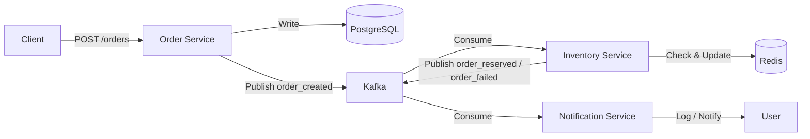

# order-processing-system-microservices

Home Repository for Order Processing System (OPS)

## About

A hobby-project for my own experiments, which is a simple event-driven microservices system built with Go, Kafka, Redis, and PostgreSQL.

This project demonstrates how independent services communicate asynchronously using Kafka, while maintaining clear separation of concerns and scalability.

## Repositories

This is the home repository for the following services:

- [rbkr-ops-order-service](https://github.com/ruanbekker/rbkr-ops-order-service)
- [rbkr-ops-inventory-service](https://github.com/ruanbekker/rbkr-ops-inventory-service)
- [rbkr-ops-notification-service](https://github.com/ruanbekker/rbkr-ops-notification-service)

## Architecture



## How it works

1. A client creates an order via the Order Service

2. The Order Service:
   - Stores the order in PostgreSQL
   - Publishes an `order_created` event to Kafka

3. The Inventory Service:
   - Consumes `order_created`
   - Checks stock in Redis
   - Publishes:
     - `order_reserved` if stock is available
     - `order_failed` if not

4. The Notification Service:
   - Consumes the result event
   - Logs or sends a notification

## Services

### Order Service

- REST API (`POST /orders`)
- Stores orders in PostgreSQL
- Produces `order_created` events

### Inventory Service

- Consumes `order_created`
- Uses Redis for stock management
- Produces `order_reserved` / `order_failed`

### Notification Service

- Consumes result events
- Logs notifications (simulated)

## Tech Stack

- Go (Golang)
- Kafka (event streaming)
- Redis (real-time state / inventory)
- PostgreSQL (persistent storage)
- Docker & Docker Compose

## This repo

- Documentation (architecture, diagrams, flow)
- docker-compose.yml
- KinD cluster setup script
- Kubernetes manifests (or Helm)

## Getting Started

Clone these repositories to the path specified in the `docker-compose.yaml`

```bash
git clone https://github.com/ruanbekker/rbkr-ops-order-service ../rbkr-ops-order-service
git clone https://github.com/ruanbekker/rbkr-ops-inventory-service ../rbkr-ops-inventory-service
git clone https://github.com/ruanbekker/rbkr-ops-notification-service ../rbkr-ops-notification-service
```

Boot the stack:

```bash
docker compose up --build -d
```

Once everything is started, create the kafka topics, the tables and set the inventory:

```bash
./scripts/bootstrap.sh
```

Create a order:

```bash
curl -X POST localhost:8080/orders -H "Content-Type: application/json" -d '{"product_id":"books","quantity":1}'
{
  "id":"efb85e08-1fba-4442-9eda-5786c9160b06",
  "product_id":"books",
  "quantity":1,
  "status":"created",
  "created_at":"2026-04-30T16:34:18.123857793Z"
}
```

Check the logs:

```bash
order-service-1      | [GIN] 2026/04/30 - 16:34:18 | 201 |   1.95ms |      172.18.0.1 | POST     "/orders"
inventory-service-1  | 2026/04/30 16:34:18 received message: {"order_id":"efb85e08-1fba-4442-9eda-5786c9160b06","product_id":"books","quantity":1}
inventory-service-1  | 2026/04/30 16:34:18 order reserved: efb85e08-1fba-4442-9eda-5786c9160b06
notification-service-1  | 2026/05/02 09:41:50 received [order_reserved]: {"order_id":"efb85e08-1fba-4442-9eda-5786c9160b06","status":"reserved"}
notification-service-1  | 2026/05/02 09:41:50 📦 Order efb85e08-1fba-4442-9eda-5786c9160b06 reserved successfully!
```

Check Redis to see if a book was deducted from the quantity (the initial number was 10):

```bash
docker exec -it redis redis-cli GET books 
"9"
```

We can also check the kafka topic by consuming from it:

```bash
docker exec -it kafka kafka-console-consumer.sh  --bootstrap-server localhost:9092 --topic order_created  --from-beginning
```
